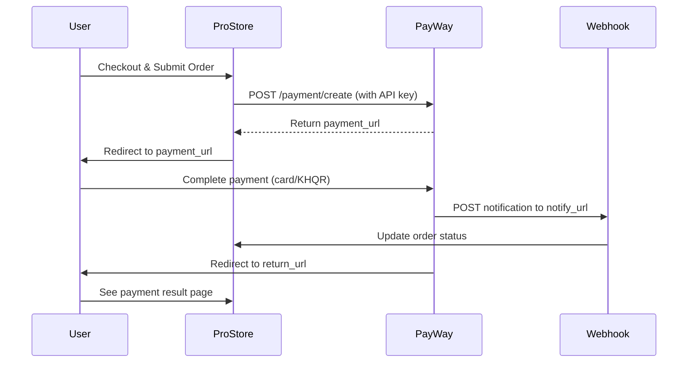

# 🛍️ ProStore - ABA PayWay Integration

> 💳 **Next.js E-commerce + ABA PayWay Payment Gateway**  
> A production-ready integration template for accepting payments via ABA PayWay in your Next.js store.

---

## 📋 Table of Contents
- [Overview](#-overview)
- [Features](#-features)
- [Tech Stack](#-tech-stack)
- [🔐 Environment Variables](#-environment-variables)
- [Installation](#-installation)
- [Development](#-development)
- [PayWay Integration Guide](#-payway-integration-guide)
- [Project Structure](#-project-structure)
- [Security Checklist](#-security-checklist)
- [Troubleshooting](#-troubleshooting)
- [License](#-license)

---

## 🌟 Overview
**ProStore_PayWay-Integration** is a modular Next.js template designed to help Cambodian e-commerce developers quickly integrate **ABA PayWay** payment processing. Built with TypeScript, Tailwind CSS, and the Next.js Pages Router for maximum compatibility.

✅ Supports sandbox & production environments  
✅ Modular payment utilities (`lib/payway.js`)  
✅ Webhook-ready API routes  
✅ Type-safe with TypeScript  

---

## ✨ Features
- 🔐 Secure checkout flow with ABA PayWay redirect
- 🔄 Webhook handler for payment status updates (`/api/payment/notify`)
- 🎨 Responsive UI components (`components/PaymentModal.tsx`)
- 🗂️ Clean architecture: `lib/` for utilities, `pages/api/` for endpoints
- 🌐 Environment-based config via `.env`
- 📦 Easy deployment to Vercel, Netlify, or Node.js server

---

## 🛠️ Tech Stack
| Layer | Technology |
|-------|-----------|
| Framework | Next.js 14 (Pages Router) |
| Language | TypeScript, JavaScript |
| Styling | Tailwind CSS + CSS Modules |
| Payment | ABA PayWay API (Sandbox & Production) |
| Tooling | ESLint, Prettier, TypeScript |

---

## 🔐 Environment Variables

Create a `.env` file in the root (based on `.env.example`):

```env
# 🏦 ABA PayWay Configuration
PAYWAY_API_URL=https://checkout-sandbox.payway.com.kh/api/v1
# For production: https://checkout.payway.com.kh/api/v1

PAYWAY_MERCHANT_ID=YOUR_MERCHANT_ID_HERE
# Example: ProStore-PayWay-SandBox

PAYWAY_API_KEY=your_secret_api_key_here
# ⚠️ Never commit this to version control!

# 🔗 Application URLs
NEXT_PUBLIC_BASE_URL=http://localhost:3000
PAYWAY_RETURN_URL=http://localhost:3000/payment/return
PAYWAY_NOTIFY_URL=http://localhost:3000/api/payment/notify

# 🔑 Security
NEXTAUTH_SECRET=generate_with_openssl_rand_base64_32
NODE_ENV=development
```

### 🔑 How to Get PayWay Credentials
1. Visit [ABA PayWay Sandbox](https://checkout-sandbox.payway.com.kh/) (or production portal)
2. Log in with your merchant account
3. Go to **Settings → API Credentials**
4. Copy:
   - `Merchant ID`
   - `API Key` (keep secret!)
   - Confirm `API URL` matches your environment

---

## 🚀 Installation

```bash
# 1. Clone the repo
git clone https://github.com/SereyodamChek/ProStore_PayWay-Intergration.git
cd ProStore_PayWay-Intergration

# 2. Install dependencies
npm install
# or
yarn install

# 3. Configure environment
cp .env.example .env
# → Edit .env with your PayWay credentials

# 4. Start development server
npm run dev
```

Visit [http://localhost:3000](http://localhost:3000) 🎉

---

## 💻 Development Scripts

| Command | Description |
|---------|-------------|
| `npm run dev` | Start dev server (http://localhost:3000) |
| `npm run build` | Build for production |
| `npm run start` | Start production server |
| `npm run lint` | Run ESLint + TypeScript checks |
| `npm run type-check` | Verify TypeScript compilation |

---

## 💳 PayWay Integration Guide

### 🔁 Payment Flow


### 📦 Key Files
| File | Purpose |
|------|---------|
| `lib/payway.js` | PayWay API utilities (create payment, check status) |
| `pages/api/payment/create.js` | Endpoint to initiate PayWay request |
| `pages/api/payment/notify.js` | Webhook handler for PayWay callbacks |
| `components/PaymentModal.tsx` | Reusable payment UI component |
| `pages/payment/return.js` | Post-payment result page |

### 🧪 Example: Create Payment (`lib/payway.js`)
```javascript
export async function createPayment({ orderId, amount, currency = 'USD' }) {
  const res = await fetch(`${process.env.PAYWAY_API_URL}/payment/create`, {
    method: 'POST',
    headers: {
      'Authorization': `Bearer ${process.env.PAYWAY_API_KEY}`,
      'Content-Type': 'application/json',
    },
    body: JSON.stringify({
      merchant_id: process.env.PAYWAY_MERCHANT_ID,
      order_id: orderId,
      amount: parseFloat(amount).toFixed(2),
      currency,
      return_url: process.env.PAYWAY_RETURN_URL,
      notify_url: process.env.PAYWAY_NOTIFY_URL,
      // Optional: customer info, items, etc.
    }),
  });

  if (!res.ok) throw new Error('PayWay API error');
  return await res.json();
}
```

---

## 📁 Project Structure
```
ProStore_PayWay-Intergration/
├── components/
│   └── PaymentModal.tsx      # Reusable payment UI
├── lib/
│   └── payway.js             # PayWay API helpers
├── pages/
│   ├── api/
│   │   └── payment/
│   │       ├── create.js     # Initiate payment
│   │       └── notify.js     # Webhook endpoint
│   ├── payment/
│   │   └── return.js         # Payment result page
│   ├── _app.js               # App entry point
│   └── index.js              # Home/checkout page
├── styles/
│   ├── globals.css           # Global Tailwind styles
│   └── PaymentModal.module.css
├── .env.example              # Env var template
├── next.config.js            # Next.js config
├── package.json              # Dependencies & scripts
├── tsconfig.json             # TypeScript config
└── README.md                 # This file
```

---

## 🔒 Security Checklist
- ✅ **Never** expose `PAYWAY_API_KEY` in client-side code
- ✅ Validate webhook requests (verify signature if provided by PayWay)
- ✅ Use HTTPS in production for all endpoints
- ✅ Sanitize & validate all user inputs server-side
- ✅ Log payment events (exclude sensitive data)
- ✅ Rotate API keys periodically via PayWay portal
- ✅ Restrict `notify_url` to accept only PayWay IPs (if documented)

---

## 🐛 Troubleshooting

| Error | Likely Cause | Fix |
|-------|-------------|-----|
| `401 Unauthorized` | Invalid `PAYWAY_API_KEY` or `MERCHANT_ID` | Double-check credentials in PayWay portal |
| Webhook not triggering | `notify_url` not publicly accessible | Use ngrok for local testing: `ngrok http 3000` |
| Redirect loop after payment | `return_url` mismatch | Ensure URL exactly matches PayWay merchant settings |
| TypeScript errors | Missing types or config | Run `npm run type-check` and review `tsconfig.json` |
| CORS issues | API called from wrong origin | Configure allowed origins in Next.js config or middleware |

### 🔍 Test Webhooks Locally
```bash
# Install ngrok
npm install -g ngrok

# Expose localhost
ngrok http 3000

# Update .env:
PAYWAY_NOTIFY_URL=https://your-ngrok-id.ngrok.io/api/payment/notify
```

---

## 📄 License
© 2026 **ProStore**. All rights reserved.  
This code is provided for educational and integration purposes. Commercial use requires proper licensing and compliance with ABA PayWay terms.

---

> 🇰🇭 **ABA PayWay Resources**  
> • [Sandbox Portal](https://checkout-sandbox.payway.com.kh/)  
> • [Production Portal](https://checkout.payway.com.kh/)  
> • [Developer Docs](https://developer.payway.com.kh/)  
> • [Support](mailto:support@payway.com.kh)

*Empowering Cambodian commerce — one seamless payment at a time.* 💙💛
